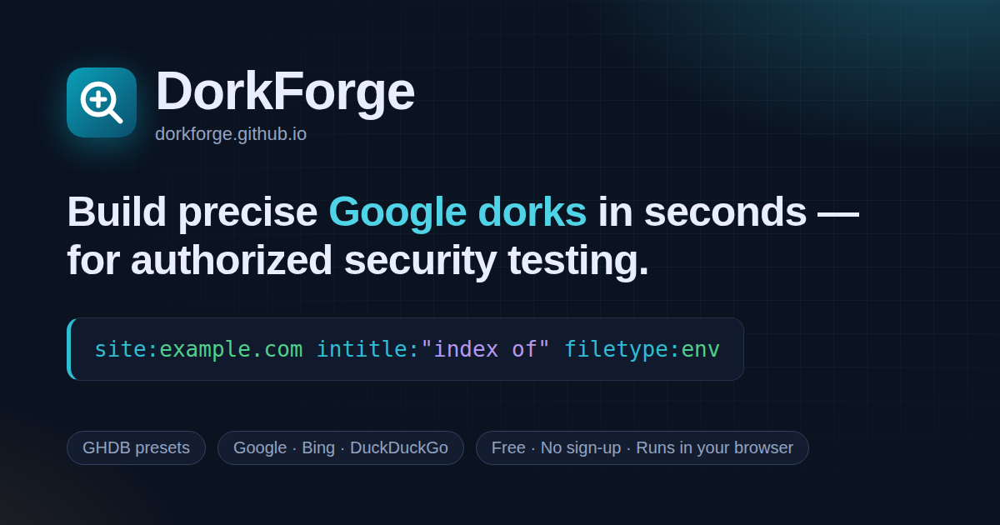
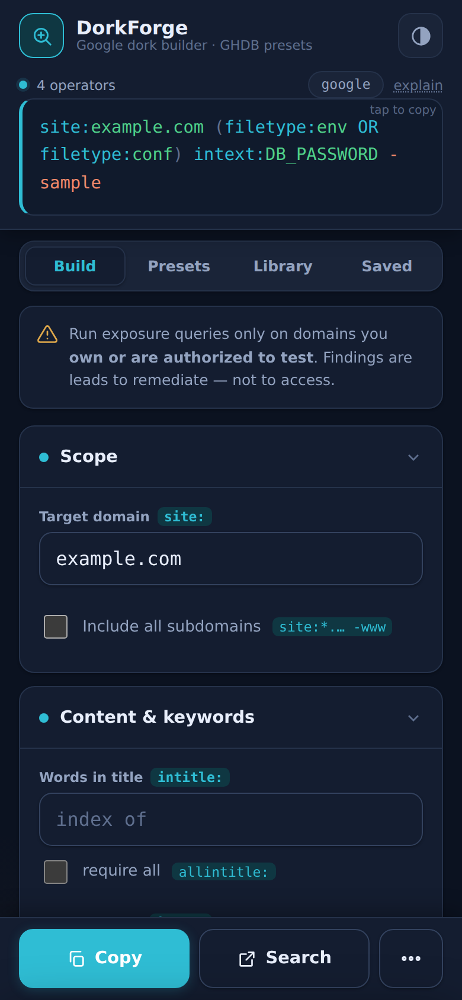
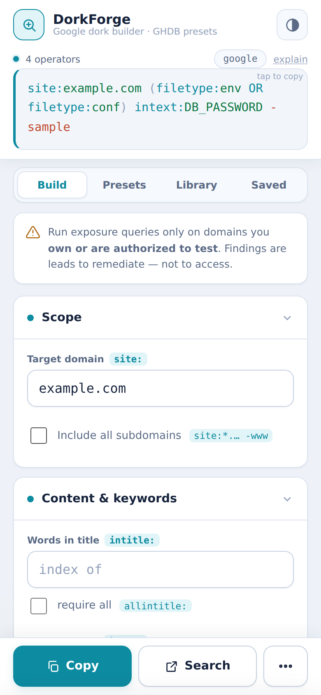
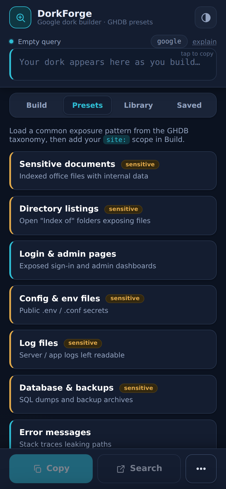
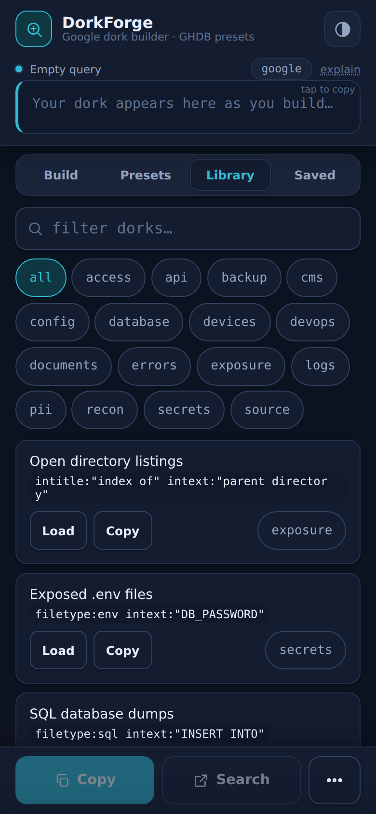

<div align="center">

<a href="https://dorkforge.github.io/">
  
</a>

# DorkForge

**Build precise Google dorks in seconds — for authorized security testing.**

A free, private, mobile‑first search‑query builder with GHDB presets and a curated dork library.<br/>
No sign‑up, no backend, no tracking. Runs entirely in your browser.

[](https://dorkforge.github.io/)
[](https://github.com/DorkForge/DorkForge.github.io/actions/workflows/static.yml)
[](https://dorkforge.github.io/site.webmanifest)
[](#-tech-stack)

[**Open DorkForge →**](https://dorkforge.github.io/) &nbsp;·&nbsp;
[Features](#-features) &nbsp;·&nbsp;
[Operators](#-supported-operators) &nbsp;·&nbsp;
[Privacy](#-privacy) &nbsp;·&nbsp;
[Run locally](#-run-locally) &nbsp;·&nbsp;
[Contributing](#-contributing)

<br/>

<a href="https://dorkforge.github.io/">
  
</a>

</div>

---

> [!IMPORTANT]
> **Use responsibly.** DorkForge is built for defenders: security teams, bug bounty hunters working in scope, and site owners auditing their own attack surface. Only run exposure queries against domains you **own or have written permission to test**. Searching is legal; accessing, downloading or exploiting data you aren't authorized to reach is not. Treat every result as a lead to remediate.

## ✨ Features

| | |
|---|---|
| 🧱 **Visual builder** | Fill in plain form fields and get a correctly formed query. Scope, content, file types, exclusions, date windows, number ranges and `OR` groups are all covered. |
| 🎨 **Live syntax highlighting** | Operators, values, phrases and exclusions are colour‑coded as you type, with a running operator count. |
| 🗣️ **Plain‑English explain** | Tap **explain** to read the query back as a sentence, e.g. *"Finds pages limited to example.com, returning only ENV, CONF files…"* |
| ⚠️ **Query linting** | Inline notes catch common mistakes: `allintitle:` mixed with other operators, empty date windows, reversed ranges, malformed domains, too many OR'd file types, and sensitive dorks with no `site:` scope. |
| 🗂️ **12 GHDB presets** | One‑tap patterns based on the Google Hacking Database taxonomy. High‑risk categories carry a **sensitive** tag. |
| 📚 **Curated library** | 24 ready‑made dorks across 16 tags (secrets, devops, database, pii…), with search and tag filters. |
| 🔎 **Multi‑engine** | Run queries on **Google**, **Bing** or **DuckDuckGo**. Google‑only operators are dropped automatically for other engines, and DorkForge tells you when that happens. |
| 💾 **History & saved queries** | Every copied or searched query is logged. Bookmark favourites and export either list as **CSV**. All of it stays in `localStorage`. |
| 🔗 **Shareable deep links** | Share a query as a URL (`#q=…&e=bing`) using the native share sheet, or copy the link. |
| 📱 **Mobile‑first PWA** | Thumb‑reach action bar, bottom sheet, haptics, safe‑area aware. Installable to the home screen. |
| 🖥️ **Desktop workspace** | On wide screens the query, actions and a live plain‑English explanation sit in a side panel next to a two‑column builder, preset grid and library grid. |
| 🌗 **Light · Dark · Auto** | Follows your OS by default. Your choice is remembered. |
| ⌨️ **Keyboard friendly** | <kbd>Ctrl</kbd>/<kbd>⌘</kbd> + <kbd>Enter</kbd> copies the query, <kbd>Esc</kbd> closes the sheet, and the query box works with <kbd>Enter</kbd>/<kbd>Space</kbd>. |

## 📸 Screenshots

<div align="center">

| Build (dark) | Build (light) | Presets | Library |
|:---:|:---:|:---:|:---:|
|  |  |  |  |

</div>

## 🚀 Quick start

1. Open **[dorkforge.github.io](https://dorkforge.github.io/)**.
2. Enter a domain you're authorized to test under **Scope → Target domain**.
3. Add content filters by hand, or pick a starting point from **Presets** or **Library**.
4. Tap **Copy** to put the query on your clipboard, or **Search** to run it on the selected engine.

**Example.** Scope `example.com`, file types `env` + `conf`, body text `DB_PASSWORD`, exclude `sample`:

```text
site:example.com (filetype:env OR filetype:conf) intext:DB_PASSWORD -sample
```

## 🧩 Supported operators

| Operator | Builder field | What it does | Engines |
|---|---|---|---|
| `site:` | Target domain | Limit results to one host | Google · Bing · DDG |
| `site:*.` + `-site:www.` | Include all subdomains | Surface forgotten dev and staging hosts | Google · Bing · DDG |
| `intitle:` / `allintitle:` | Words in title | Match words in the page `<title>` | Google (widest support) |
| `inurl:` / `allinurl:` | Words in URL | Match words in the URL path | Google (widest support) |
| `intext:` | Words in body | Match words in the page body | Google · Bing |
| `"…"` | Exact phrase | Match an exact phrase | All |
| `filetype:` | File types | 16 one‑tap types plus any custom extension. Several types are wrapped in an `OR` group | Google · Bing · DDG |
| `-term` | Exclude | Remove noise such as `sample` or `template` | All |
| `after:` / `before:` | Indexed after / before | Date window | **Google only** |
| `a..b` | Number range | Numeric range, e.g. `2020..2024` | Google |
| `( a OR b )` | Any of | Match at least one of several terms | All |

> [!NOTE]
> Operator support differs by engine and changes over time. Google supports the widest set. DorkForge removes `before:` and `after:` for Bing and DuckDuckGo and shows a note when it does.

<details>
<summary><b>🗂️ Preset categories (12)</b></summary>
<br/>

| Preset | Targets | Sensitive |
|---|---|:---:|
| Sensitive documents | Indexed office files with internal data | ⚠️ |
| Directory listings | Open "Index of" folders exposing files | ⚠️ |
| Login & admin pages | Exposed sign‑in and admin dashboards | |
| Config & env files | Public `.env` / `.conf` secrets | ⚠️ |
| Log files | Server and app logs left readable | ⚠️ |
| Database & backups | SQL dumps and backup archives | ⚠️ |
| Error messages | Stack traces leaking paths | |
| Exposed devices | Camera, router and printer panels | |
| Git & source exposure | Public `.git` folders and source | ⚠️ |
| Credentials & keys | Files that tend to carry secrets | ⚠️ |
| Personal data (PII) | Lists, CVs and sheets with PII | ⚠️ |
| Subdomain discovery | Forgotten dev and staging hosts | |

Presets fill in the content fields and leave scope empty. Add your `site:` in **Build** before you run one.

</details>

<details>
<summary><b>📚 Library tags (16)</b></summary>
<br/>

`access` · `api` · `backup` · `cms` · `config` · `database` · `devices` · `devops` · `documents` · `errors` · `exposure` · `logs` · `pii` · `recon` · `secrets` · `source`

Examples include open directory listings, exposed `.env` and `.git/config` files, SQL dumps, phpMyAdmin, Jenkins, Grafana and Kibana consoles, Swagger/OpenAPI docs, `phpinfo()` pages and `.htpasswd` leaks.

</details>

## 🔒 Privacy

DorkForge is a static site with **no backend, no analytics, no cookies and no third‑party scripts**. The only external request is for web fonts (Inter and JetBrains Mono) from Google Fonts.

- Queries are built on your device and sent **straight from your browser** to the search engine you pick.
- History, saved queries and your theme are stored **only** in your browser's `localStorage`:

  | Key | Contents |
  |---|---|
  | `dorkforge.m.hist` | Recent queries (up to 80) |
  | `dorkforge.m.fav` | Saved queries (up to 80) |
  | `dorkforge.theme` | `auto`, `light` or `dark` |

- To erase everything, use **Saved → ✕** on each list, or clear site data in your browser.

## 🔗 Deep links

Any query can be opened from a URL fragment. The fragment never reaches a server.

```text
https://dorkforge.github.io/#q=<url-encoded query>&e=<google|bing|duckduckgo>
```

```text
https://dorkforge.github.io/#q=site%3Aexample.com%20filetype%3Apdf%20intext%3Aconfidential&e=google
```

The query is parsed back into the builder fields. Anything the parser doesn't recognise goes into **Free keywords**.

## 🛠 Tech stack

- **One HTML file.** Vanilla HTML, CSS and JavaScript with no framework, no build step and no dependencies. Typography uses Inter and JetBrains Mono.
- **SEO ready.** Canonical URL, Open Graph and Twitter cards, JSON‑LD (`WebSite`, `WebApplication`, `FAQPage`), `sitemap.xml` and `robots.txt`.
- **PWA.** `site.webmanifest` with SVG, PNG and maskable icons, plus theme colours for light and dark.
- **Accessible.** Semantic landmarks, ARIA tabs and live regions, keyboard support and respect for `prefers-color-scheme`.
- **Hosting.** GitHub Pages, deployed by GitHub Actions.

## 📁 Project structure

```text
.
├── index.html              # The whole app: markup, styles, logic, SEO metadata
├── 404.html                # Custom not-found page (noindex)
├── favicon.svg             # Vector favicon
├── site.webmanifest        # PWA manifest
├── robots.txt              # Crawler rules + sitemap pointer
├── sitemap.xml             # Sitemap for search engines
├── .nojekyll               # Serve files as-is (skip Jekyll)
├── assets/
│   ├── og-image.png        # 1200×630 social preview
│   ├── icon-192.png        # PWA icons
│   ├── icon-512.png
│   ├── icon-maskable-512.png
│   └── apple-touch-icon.png
└── .github/
    ├── assets/             # README screenshots (not deployed)
    ├── profile/README.md   # Organization profile README (see below)
    └── workflows/static.yml
```

## 💻 Run locally

No install and no build. Serve the folder over HTTP so absolute paths such as `/favicon.svg` and the manifest resolve:

```bash
git clone https://github.com/DorkForge/DorkForge.github.io.git
cd DorkForge.github.io

# pick one
python3 -m http.server 8000
npx serve .
```

Then open <http://localhost:8000>.

> [!TIP]
> Opening `index.html` straight from disk (`file://`) mostly works, but icons, the manifest and some clipboard features need a real HTTP origin.

## 🚢 Deployment

Every push to `main` runs [`.github/workflows/static.yml`](.github/workflows/static.yml), which uploads the repository and publishes it to **GitHub Pages** at <https://dorkforge.github.io/>. You can also start the workflow by hand from the **Actions** tab (`workflow_dispatch`).

## 🤝 Contributing

Contributions are welcome, especially new **presets**, **library dorks**, operator fixes and accessibility improvements.

1. Fork the repo and create a branch: `git checkout -b feat/my-change`.
2. Make your change. Presets live in the `CATEGORIES` array and library dorks in the `LIBRARY` array, both in `index.html`.
3. Test locally on a phone‑sized viewport and in both light and dark themes.
4. Open a pull request that explains what changed and why.

**Guidelines for new dorks**

- Aim them at *exposure discovery*: misconfigurations an owner would want to find and fix.
- Keep them generic and scope‑able with `site:`. Don't include real target domains.
- Choose an existing tag where one fits, and mark high‑risk presets `sensitive: true`.
- No queries whose main purpose is to harvest personal data about individuals.

Found a bug or have an idea? [Open an issue](https://github.com/DorkForge/DorkForge.github.io/issues).

## 🛡️ Security

If you find a security issue in DorkForge itself, please report it privately through [GitHub Security Advisories](https://github.com/DorkForge/DorkForge.github.io/security/advisories/new) rather than opening a public issue.

## ⚖️ Disclaimer

DorkForge generates search queries. It does not scan, crawl, access or download anything. You alone are responsible for how you use it. The authors accept no liability for misuse. Follow the law, your organisation's policies and the rules of any program you take part in.

---

<div align="center">

Made with ☕ by **[DorkForge](https://github.com/DorkForge)** &nbsp;·&nbsp; free, private & client‑side &nbsp;·&nbsp; for authorized security testing only

<sub>If DorkForge saves you time, consider giving the repo a ⭐</sub>

</div>
